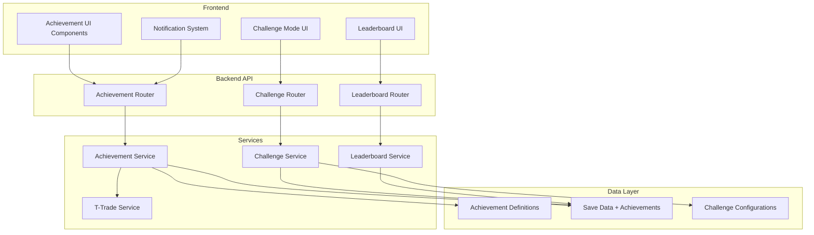

# Design Document: Achievement System

## Overview

成就系统为A股模拟交易系统提供游戏化功能，通过追踪用户交易行为、计算成就进度、解锁成就并提供视觉反馈来激励用户。系统支持两种游戏模式（自由模式和挑战模式），包含做T统计、排行榜和成就展示等功能。

## Architecture



## Components and Interfaces

### Backend Components

#### 1. Achievement Definitions (Python)

```python
from enum import Enum
from dataclasses import dataclass
from typing import Optional, Callable

class AchievementRarity(Enum):
    COMMON = "common"      # 普通
    RARE = "rare"          # 稀有
    EPIC = "epic"          # 史诗
    LEGENDARY = "legendary" # 传说

class AchievementCategory(Enum):
    TRADING = "trading"     # 交易
    PROFIT = "profit"       # 收益
    MILESTONE = "milestone" # 里程碑
    STREAK = "streak"       # 连续
    T_TRADE = "t_trade"     # 做T
    SPECIAL = "special"     # 特殊
    CHALLENGE = "challenge" # 挑战

class ProgressType(Enum):
    BOOLEAN = "boolean"     # 是/否类型
    COUNT = "count"         # 计数类型
    PERCENTAGE = "percentage" # 百分比类型
    AMOUNT = "amount"       # 金额类型

@dataclass
class AchievementDefinition:
    id: str
    name: str
    description: str
    icon: str
    category: AchievementCategory
    rarity: AchievementRarity
    progress_type: ProgressType
    target_value: float
    check_condition: Callable  # Function to check if achievement is unlocked
```

#### 2. Achievement Service Interface

```python
class AchievementService:
    def get_all_definitions(self) -> list[AchievementDefinition]:
        """获取所有成就定义"""
        pass
    
    def get_achievement_progress(self, save_id: str) -> AchievementProgress:
        """获取存档的成就进度"""
        pass
    
    def check_and_unlock_achievements(self, save_id: str, context: AchievementContext) -> list[UnlockedAchievement]:
        """检查并解锁成就，返回新解锁的成就列表"""
        pass
    
    def recalculate_achievements(self, save_id: str) -> AchievementProgress:
        """从交易历史重新计算成就"""
        pass
```

#### 3. T-Trade Service Interface

```python
@dataclass
class TTradeRecord:
    id: str
    stock_code: str
    sell_price: float
    buy_price: float
    quantity: int
    profit: float
    fee: float
    trade_date: str

@dataclass
class TTradeStatistics:
    total_trades: int
    successful_trades: int
    success_rate: float
    total_profit: float
    best_trade_profit: float
    worst_trade_loss: float
    trades: list[TTradeRecord]

class TTradeService:
    def detect_t_trades(self, trade_history: list[TradeRecord]) -> list[TTradeRecord]:
        """从交易历史中检测做T交易"""
        pass
    
    def calculate_statistics(self, t_trades: list[TTradeRecord]) -> TTradeStatistics:
        """计算做T统计数据"""
        pass
    
    def get_t_trade_statistics(self, save_id: str) -> TTradeStatistics:
        """获取存档的做T统计"""
        pass
```

#### 4. Challenge Service Interface

```python
class GameMode(Enum):
    FREE = "free"
    CHALLENGE = "challenge"

class ChallengeDifficulty(Enum):
    EASY = "easy"       # 50% return target
    MEDIUM = "medium"   # 100% return target
    HARD = "hard"       # 200% return target

@dataclass
class ChallengeConfig:
    id: str
    name: str
    difficulty: ChallengeDifficulty
    stock_code: str
    start_date: str
    end_date: str
    initial_cash: float  # Always 10000
    target_assets: float
    description: str

@dataclass
class ChallengeResult:
    challenge_id: str
    passed: bool
    final_assets: float
    target_assets: float
    return_pct: float
    completion_date: str

class ChallengeService:
    def get_available_challenges(self) -> list[ChallengeConfig]:
        """获取可用的挑战配置"""
        pass
    
    def create_challenge_save(self, challenge_id: str, save_name: str) -> SaveData:
        """创建挑战模式存档"""
        pass
    
    def evaluate_challenge(self, save_id: str) -> ChallengeResult:
        """评估挑战结果"""
        pass
    
    def get_challenge_progress(self, save_id: str) -> ChallengeProgress:
        """获取挑战进度"""
        pass
```

#### 5. Leaderboard Service Interface

```python
class LeaderboardType(Enum):
    TOTAL_RETURN = "total_return"
    TOTAL_ASSETS = "total_assets"
    ACHIEVEMENT_COUNT = "achievement_count"
    SHARPE_RATIO = "sharpe_ratio"
    T_TRADE_SUCCESS_RATE = "t_trade_success_rate"
    T_TRADE_PROFIT = "t_trade_profit"
    CHALLENGE_RETURN = "challenge_return"

@dataclass
class LeaderboardEntry:
    rank: int
    save_id: str
    save_name: str
    value: float
    achievement_count: int
    game_mode: GameMode
    is_current: bool

class LeaderboardService:
    def get_leaderboard(self, leaderboard_type: LeaderboardType, 
                        game_mode: Optional[GameMode] = None,
                        challenge_difficulty: Optional[ChallengeDifficulty] = None) -> list[LeaderboardEntry]:
        """获取排行榜"""
        pass
```

### Frontend Components

#### 1. Achievement Types (TypeScript)

```typescript
// Achievement rarity levels
type AchievementRarity = 'common' | 'rare' | 'epic' | 'legendary';

// Achievement categories
type AchievementCategory = 'trading' | 'profit' | 'milestone' | 'streak' | 't_trade' | 'special' | 'challenge';

// Progress type
type ProgressType = 'boolean' | 'count' | 'percentage' | 'amount';

// Achievement definition
interface AchievementDefinition {
  id: string;
  name: string;
  description: string;
  icon: string;
  category: AchievementCategory;
  rarity: AchievementRarity;
  progressType: ProgressType;
  targetValue: number;
}

// Achievement progress for a save
interface AchievementProgress {
  unlockedAchievements: UnlockedAchievement[];
  progressMap: Record<string, number>; // achievement_id -> current progress
}

// Unlocked achievement
interface UnlockedAchievement {
  achievementId: string;
  unlockedAt: string; // ISO date
}

// Game mode
type GameMode = 'free' | 'challenge';

// Challenge difficulty
type ChallengeDifficulty = 'easy' | 'medium' | 'hard';

// T-Trade record
interface TTradeRecord {
  id: string;
  stockCode: string;
  sellPrice: number;
  buyPrice: number;
  quantity: number;
  profit: number;
  fee: number;
  tradeDate: string;
}

// T-Trade statistics
interface TTradeStatistics {
  totalTrades: number;
  successfulTrades: number;
  successRate: number;
  totalProfit: number;
  bestTradeProfit: number;
  worstTradeLoss: number;
  trades: TTradeRecord[];
}
```

#### 2. Achievement UI Components

```typescript
// AchievementModal - Main achievement display modal
interface AchievementModalProps {
  open: boolean;
  onClose: () => void;
  saveId: string;
}

// AchievementCard - Individual achievement display
interface AchievementCardProps {
  definition: AchievementDefinition;
  progress: number;
  unlocked: boolean;
  unlockedAt?: string;
}

// AchievementNotification - Popup notification for unlocked achievements
interface AchievementNotificationProps {
  achievement: AchievementDefinition;
  onDismiss: () => void;
}

// AchievementBadge - Badge showing new achievement count
interface AchievementBadgeProps {
  count: number;
  onClick: () => void;
}

// TTradeStatsPanel - T-Trade statistics display
interface TTradeStatsPanelProps {
  statistics: TTradeStatistics;
}

// LeaderboardPanel - Leaderboard display
interface LeaderboardPanelProps {
  type: LeaderboardType;
  currentSaveId: string;
}

// ChallengeModePanel - Challenge mode progress display
interface ChallengeModePanelProps {
  challengeConfig: ChallengeConfig;
  currentAssets: number;
  currentDate: string;
}
```

## Data Models

### Extended Save Data Structure

```python
@dataclass
class ExtendedSaveData(SaveData):
    # Game mode
    game_mode: GameMode = GameMode.FREE
    
    # Challenge mode specific
    challenge_config: Optional[ChallengeConfig] = None
    challenge_result: Optional[ChallengeResult] = None
    
    # Achievement data
    achievement_progress: AchievementProgress = field(default_factory=AchievementProgress)
    
    # T-Trade data
    t_trade_statistics: TTradeStatistics = field(default_factory=TTradeStatistics)
    
    # New unlocked achievements (for notification)
    new_achievements: list[str] = field(default_factory=list)
```

### Achievement Progress Structure

```python
@dataclass
class AchievementProgress:
    unlocked_achievements: list[UnlockedAchievement] = field(default_factory=list)
    progress_map: dict[str, float] = field(default_factory=dict)
    
    def to_dict(self) -> dict:
        return {
            "unlocked_achievements": [
                {"achievement_id": a.achievement_id, "unlocked_at": a.unlocked_at}
                for a in self.unlocked_achievements
            ],
            "progress_map": self.progress_map
        }
    
    @classmethod
    def from_dict(cls, data: dict) -> "AchievementProgress":
        return cls(
            unlocked_achievements=[
                UnlockedAchievement(a["achievement_id"], a["unlocked_at"])
                for a in data.get("unlocked_achievements", [])
            ],
            progress_map=data.get("progress_map", {})
        )
```

### Challenge Configuration Structure

```python
# Predefined challenge configurations
CHALLENGE_CONFIGS = [
    ChallengeConfig(
        id="easy_001",
        name="新手试炼",
        difficulty=ChallengeDifficulty.EASY,
        stock_code="000001",  # 平安银行
        start_date="2024-01-02",
        end_date="2024-03-29",
        initial_cash=10000.0,
        target_assets=15000.0,  # 50% return
        description="在3个月内将1万元增值到1.5万元"
    ),
    ChallengeConfig(
        id="medium_001",
        name="进阶挑战",
        difficulty=ChallengeDifficulty.MEDIUM,
        stock_code="600519",  # 贵州茅台
        start_date="2024-01-02",
        end_date="2024-06-28",
        initial_cash=10000.0,
        target_assets=20000.0,  # 100% return
        description="在6个月内将1万元翻倍到2万元"
    ),
    ChallengeConfig(
        id="hard_001",
        name="大师之路",
        difficulty=ChallengeDifficulty.HARD,
        stock_code="300750",  # 宁德时代
        start_date="2024-01-02",
        end_date="2024-12-31",
        initial_cash=10000.0,
        target_assets=30000.0,  # 200% return
        description="在一年内将1万元增值到3万元"
    ),
]
```

## Correctness Properties

*A property is a characteristic or behavior that should hold true across all valid executions of a system-essentially, a formal statement about what the system should do. Properties serve as the bridge between human-readable specifications and machine-verifiable correctness guarantees.*

### Property 1: Achievement Data Round-Trip Consistency
*For any* valid AchievementProgress object, serializing to JSON then deserializing SHALL produce an equivalent AchievementProgress object with identical unlocked achievements and progress values.
**Validates: Requirements 1.6, 14.5**

### Property 2: Achievement Definition Completeness
*For any* achievement in the system, it SHALL have all required fields (id, name, description, icon, category, rarity, progress_type, target_value) with valid values from their respective enums.
**Validates: Requirements 1.1, 1.2, 1.3**

### Property 3: Trade Count Achievement Thresholds
*For any* trade history with N completed trades, the Achievement_System SHALL unlock exactly the trade count achievements whose thresholds are ≤ N (First Trade at 1, Active Trader at 10, Trading Master at 100).
**Validates: Requirements 2.1, 2.2, 2.3, 2.6**

### Property 4: Profit Achievement Thresholds
*For any* account state with total return R%, the Achievement_System SHALL unlock exactly the profit achievements whose thresholds are ≤ R (Profitable Beginner at 10%, Skilled Investor at 50%, Double Your Money at 100%, Trading Legend at 500%).
**Validates: Requirements 3.1, 3.2, 3.3, 3.4, 3.7**

### Property 5: Milestone Achievement Thresholds
*For any* account with total assets A, the Achievement_System SHALL unlock exactly the milestone achievements whose asset thresholds are ≤ A.
**Validates: Requirements 4.1, 4.2, 4.3**

### Property 6: Streak Detection Correctness
*For any* sequence of daily returns, the streak counter SHALL correctly identify the longest consecutive sequence of positive returns, and unlock streak achievements at thresholds 3, 7, and 30.
**Validates: Requirements 5.1, 5.2, 5.3, 5.5, 5.6**

### Property 7: T-Trade Detection Accuracy
*For any* trade history, a T-trade SHALL be detected if and only if there exists a sell order followed by a buy order for the same stock on the same trading day, where the user held shares before the sell.
**Validates: Requirements 7.1**

### Property 8: T-Trade Profit Calculation
*For any* T-trade record, the profit SHALL equal (sell_price - buy_price) * quantity - total_fees, where total_fees includes both sell and buy transaction fees.
**Validates: Requirements 7.7**

### Property 9: T-Trade Achievement Thresholds
*For any* T-trade statistics with S successful trades and R success rate, the Achievement_System SHALL unlock exactly the T-trade achievements whose conditions are satisfied (count thresholds at 1, 10, 50, 100; rate thresholds at 60% with 20+ trades, 80% with 50+ trades).
**Validates: Requirements 8.1, 8.2, 8.3, 8.4, 8.5, 8.6**

### Property 10: Challenge Mode Constraints
*For any* Challenge Mode save, the initial cash SHALL be exactly 10,000 yuan, stock count SHALL be exactly 1, and the configuration SHALL be immutable after creation.
**Validates: Requirements 16.4, 17.4, 17.5**

### Property 11: Challenge Evaluation Correctness
*For any* completed challenge, the result SHALL be "Passed" if and only if final_assets >= target_assets at the challenge end date.
**Validates: Requirements 18.1, 18.2, 18.3**

### Property 12: Leaderboard Ordering
*For any* leaderboard query, the entries SHALL be sorted in descending order by the specified metric value, with correct rank assignments (1, 2, 3, ...).
**Validates: Requirements 12.1, 12.2, 12.3, 12.4, 12.5, 12.6**

### Property 13: New Save Achievement Initialization
*For any* newly created save, the achievement progress SHALL be initialized with zero unlocked achievements and empty progress map.
**Validates: Requirements 1.4**

## Error Handling

### Achievement Service Errors

| Error Type | Condition | Handling |
|------------|-----------|----------|
| SaveNotFoundError | Save ID does not exist | Return 404 with error message |
| AchievementNotFoundError | Achievement ID is invalid | Log warning, skip achievement |
| ProgressCalculationError | Cannot calculate progress | Return partial progress, log error |
| SerializationError | JSON serialization fails | Return 500, preserve original data |

### T-Trade Service Errors

| Error Type | Condition | Handling |
|------------|-----------|----------|
| InvalidTradeSequence | Trade history is malformed | Skip invalid trades, log warning |
| CalculationOverflow | Profit calculation overflow | Cap at max float value |

### Challenge Service Errors

| Error Type | Condition | Handling |
|------------|-----------|----------|
| ChallengeNotFoundError | Challenge ID is invalid | Return 404 |
| ChallengeAlreadyCompleted | Attempting to modify completed challenge | Return 400 |
| InvalidGameMode | Operation not allowed for game mode | Return 400 |

## Testing Strategy

### Unit Tests
- Test individual achievement condition checks
- Test T-trade detection logic with edge cases
- Test profit/loss calculations
- Test streak detection algorithm
- Test challenge evaluation logic

### Property-Based Tests
- Use Hypothesis library for Python backend
- Minimum 100 iterations per property test
- Test round-trip serialization for all data structures
- Test achievement threshold logic with random inputs
- Test leaderboard ordering with random data

### Integration Tests
- Test achievement unlocking flow end-to-end
- Test save/load with achievement data
- Test challenge mode creation and completion
- Test leaderboard updates on save changes

### Frontend Tests
- Test achievement notification display and dismissal
- Test modal open/close behavior
- Test progress bar calculations
- Test theme compatibility (light/dark)
