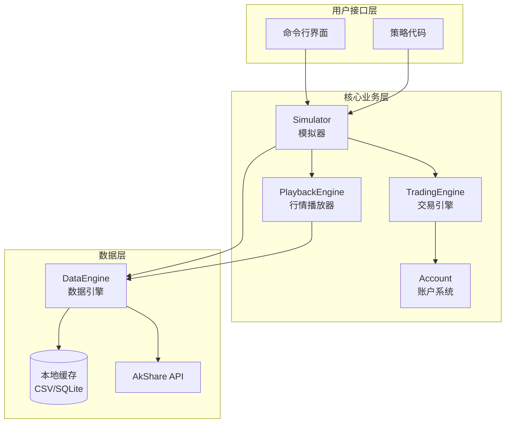
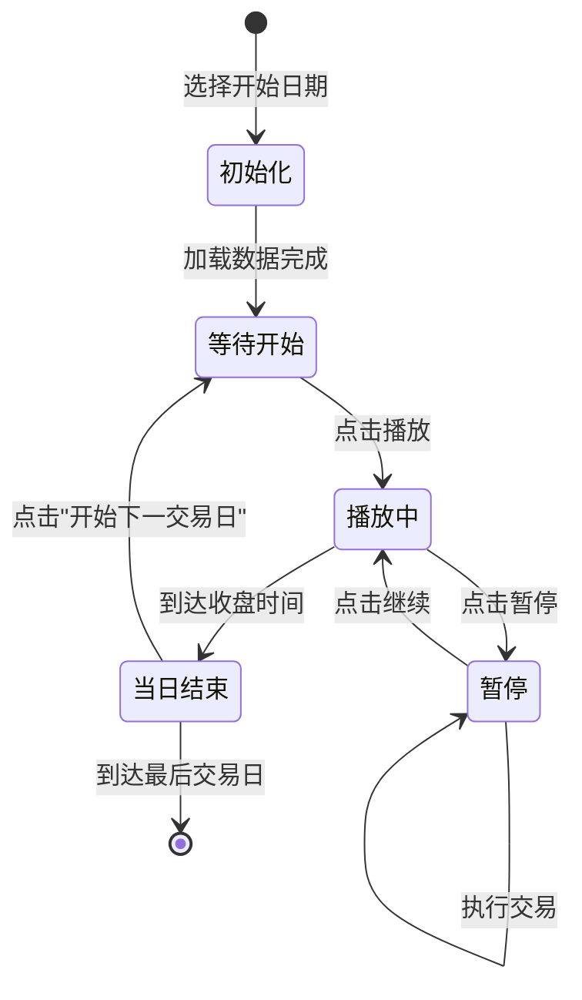

# Design Document

## Overview

本系统是一个基于 Python 的 A 股模拟交易回测系统，使用 AkShare 作为数据源。系统采用模块化设计，包含五个核心组件：数据引擎（DataEngine）、账户系统（Account）、交易引擎（TradingEngine）、行情播放器（PlaybackEngine）和模拟器（Simulator）。

系统支持两种运行模式：
1. **日内播放模式**：用户可以设定速度播放日内行情，暂停后进行交易决策，当日结束后手动开始下一交易日
2. **自动回测模式**：自动执行策略代码，快速验证策略有效性

## Architecture



### 日内播放模式状态机



## Components and Interfaces

### DataEngine 类

负责股票数据的获取、缓存和管理。

```python
from dataclasses import dataclass
from datetime import date
from typing import Optional
import pandas as pd

@dataclass
class StockInfo:
    """股票基本信息"""
    code: str           # 股票代码，如 "600519"
    name: str           # 股票名称，如 "贵州茅台"
    market: str         # 市场，"sh" 或 "sz"

class DataEngine:
    def __init__(self, cache_dir: str = "./data_cache"):
        """初始化数据引擎，指定缓存目录"""
        pass
    
    def get_stock_list(self) -> list[StockInfo]:
        """获取所有 A 股股票列表"""
        pass
    
    def get_daily_data(
        self, 
        code: str, 
        start_date: date, 
        end_date: date,
        adjust: str = "qfq"  # 前复权
    ) -> pd.DataFrame:
        """
        获取股票日线数据
        返回 DataFrame 包含: date, open, high, low, close, volume
        """
        pass
    
    def get_intraday_data(
        self,
        code: str,
        trade_date: date
    ) -> pd.DataFrame:
        """
        获取股票日内分时数据
        返回 DataFrame 包含: time, price, volume, turnover_rate
        如果真实分时数据不可用，基于日线数据模拟生成
        """
        pass
    
    def generate_simulated_intraday(
        self,
        daily_bar: "DailyBar"
    ) -> pd.DataFrame:
        """
        基于日线数据模拟生成分时走势
        生成 240 个数据点（9:30-11:30, 13:00-15:00）
        """
        pass
    
    def normalize_code(self, code: str) -> str:
        """统一股票代码格式，处理 sh/sz 前缀"""
        pass
    
    def _load_from_cache(self, code: str, start_date: date, end_date: date) -> Optional[pd.DataFrame]:
        """从本地缓存加载数据"""
        pass
    
    def _save_to_cache(self, code: str, data: pd.DataFrame) -> None:
        """保存数据到本地缓存"""
        pass
```

### Account 类

管理虚拟账户的资金和持仓。

```python
from dataclasses import dataclass, field
from datetime import date
from typing import Optional
import json

@dataclass
class Position:
    """持仓记录"""
    code: str               # 股票代码
    quantity: int           # 持仓数量
    cost_price: float       # 买入成本价（含手续费均摊）
    current_price: float    # 当前价格
    buy_date: date          # 买入日期（用于 T+1 判断）
    
    @property
    def market_value(self) -> float:
        """持仓市值"""
        return self.quantity * self.current_price
    
    @property
    def profit_loss(self) -> float:
        """浮动盈亏"""
        return (self.current_price - self.cost_price) * self.quantity
    
    @property
    def profit_loss_pct(self) -> float:
        """浮动盈亏百分比"""
        if self.cost_price == 0:
            return 0.0
        return (self.current_price - self.cost_price) / self.cost_price

@dataclass
class TradeFee:
    """交易费用配置"""
    stamp_tax_rate: float = 0.0005      # 印花税率 0.05%（仅卖出）
    commission_rate: float = 0.00025    # 佣金率 0.025%
    min_commission: float = 5.0         # 最低佣金 5 元

@dataclass
class Account:
    """虚拟交易账户"""
    initial_cash: float = 100000.0
    cash: float = field(init=False)
    positions: dict[str, Position] = field(default_factory=dict)
    fee_config: TradeFee = field(default_factory=TradeFee)
    
    def __post_init__(self):
        self.cash = self.initial_cash
    
    @property
    def total_market_value(self) -> float:
        """所有持仓总市值"""
        return sum(p.market_value for p in self.positions.values())
    
    @property
    def total_assets(self) -> float:
        """总资产 = 现金 + 持仓市值"""
        return self.cash + self.total_market_value
    
    def calculate_buy_fee(self, amount: float) -> float:
        """计算买入手续费"""
        commission = max(amount * self.fee_config.commission_rate, self.fee_config.min_commission)
        return commission
    
    def calculate_sell_fee(self, amount: float) -> float:
        """计算卖出手续费（含印花税）"""
        commission = max(amount * self.fee_config.commission_rate, self.fee_config.min_commission)
        stamp_tax = amount * self.fee_config.stamp_tax_rate
        return commission + stamp_tax
    
    def update_prices(self, price_dict: dict[str, float]) -> None:
        """更新持仓当前价格"""
        for code, price in price_dict.items():
            if code in self.positions:
                self.positions[code].current_price = price
    
    def to_dict(self) -> dict:
        """序列化为字典"""
        pass
    
    @classmethod
    def from_dict(cls, data: dict) -> "Account":
        """从字典反序列化"""
        pass
    
    def save(self, filepath: str) -> None:
        """保存账户状态到文件"""
        pass
    
    @classmethod
    def load(cls, filepath: str) -> "Account":
        """从文件加载账户状态"""
        pass
```

### TradingEngine 类

处理交易逻辑，包括订单验证和执行。

```python
from dataclasses import dataclass
from datetime import date
from enum import Enum
from typing import Optional

class OrderType(Enum):
    BUY = "buy"
    SELL = "sell"

class OrderStatus(Enum):
    PENDING = "pending"
    FILLED = "filled"
    REJECTED = "rejected"

@dataclass
class Order:
    """交易订单"""
    code: str
    order_type: OrderType
    price: float            # 委托价格
    quantity: int           # 委托数量
    order_date: date
    status: OrderStatus = OrderStatus.PENDING
    reject_reason: Optional[str] = None
    filled_price: Optional[float] = None
    filled_quantity: Optional[int] = None
    fee: float = 0.0

@dataclass
class DailyBar:
    """日线数据"""
    date: date
    open: float
    high: float
    low: float
    close: float
    volume: int

class TradingEngine:
    def __init__(self, account: Account):
        self.account = account
        self.trade_log: list[Order] = []
    
    def submit_buy_order(
        self, 
        code: str, 
        price: float, 
        quantity: int,
        current_date: date,
        daily_bar: Optional[DailyBar] = None  # 回测模式需要
    ) -> Order:
        """
        提交买入订单
        - 验证资金是否充足
        - 回测模式下验证价格是否在当日范围内
        """
        pass
    
    def submit_sell_order(
        self,
        code: str,
        price: float,
        quantity: int,
        current_date: date,
        daily_bar: Optional[DailyBar] = None
    ) -> Order:
        """
        提交卖出订单
        - 验证持仓是否充足
        - 验证 T+1 限制
        - 回测模式下验证价格是否在当日范围内
        """
        pass
    
    def _validate_price_in_range(self, price: float, bar: DailyBar) -> bool:
        """验证委托价格是否在当日最高最低价范围内"""
        return bar.low <= price <= bar.high
    
    def _check_t_plus_1(self, code: str, current_date: date) -> bool:
        """检查是否满足 T+1 限制（返回 True 表示可以卖出）"""
        if code not in self.account.positions:
            return False
        position = self.account.positions[code]
        return position.buy_date < current_date
    
    def _execute_buy(self, order: Order) -> None:
        """执行买入，更新账户"""
        pass
    
    def _execute_sell(self, order: Order) -> None:
        """执行卖出，更新账户"""
        pass
    
    def get_trade_history(self) -> list[Order]:
        """获取交易历史"""
        return self.trade_log
```

### PlaybackEngine 类

控制日内行情的播放、暂停和状态管理。

```python
from dataclasses import dataclass
from datetime import date, time, datetime
from enum import Enum
from typing import Optional, Callable
import time as time_module

class PlaybackState(Enum):
    """播放状态"""
    IDLE = "idle"               # 空闲，等待开始
    PLAYING = "playing"         # 播放中
    PAUSED = "paused"           # 已暂停
    DAY_ENDED = "day_ended"     # 当日结束
    FINISHED = "finished"       # 全部结束

@dataclass
class IntradayTick:
    """分时数据点"""
    time: time              # 时间 HH:MM
    price: float            # 当前价格
    volume: int             # 累计成交量
    turnover_rate: float    # 换手率
    change_pct: float       # 涨跌幅

@dataclass
class PlaybackConfig:
    """播放配置"""
    speed: float = 1.0          # 播放速度倍数（1.0 = 实时，10.0 = 10倍速）
    tick_interval: float = 1.0  # 每个 tick 的实际间隔（秒），会被 speed 调整

class PlaybackEngine:
    """日内行情播放引擎"""
    
    def __init__(self, data_engine: "DataEngine"):
        self.data_engine = data_engine
        self.state: PlaybackState = PlaybackState.IDLE
        self.config: PlaybackConfig = PlaybackConfig()
        self.current_date: Optional[date] = None
        self.current_tick_index: int = 0
        self.intraday_data: dict[str, list[IntradayTick]] = {}  # code -> ticks
        self.stock_codes: list[str] = []
        self.trading_dates: list[date] = []
        self.date_index: int = 0
        self._on_tick_callback: Optional[Callable[[dict[str, IntradayTick]], None]] = None
        self._on_day_end_callback: Optional[Callable[[date], None]] = None
    
    def setup(
        self,
        stock_codes: list[str],
        start_date: date,
        end_date: date
    ) -> None:
        """
        初始化播放引擎
        - 设置股票列表和日期范围
        - 生成交易日历
        """
        pass
    
    def set_speed(self, speed: float) -> None:
        """设置播放速度（1.0-100.0）"""
        self.config.speed = max(1.0, min(100.0, speed))
    
    def load_day(self, trade_date: date) -> None:
        """
        加载指定日期的分时数据
        - 为每只股票加载或生成分时数据
        - 重置 tick 索引
        """
        pass
    
    def play(self) -> None:
        """开始/继续播放"""
        if self.state in (PlaybackState.IDLE, PlaybackState.PAUSED):
            self.state = PlaybackState.PLAYING
    
    def pause(self) -> None:
        """暂停播放"""
        if self.state == PlaybackState.PLAYING:
            self.state = PlaybackState.PAUSED
    
    def tick(self) -> Optional[dict[str, IntradayTick]]:
        """
        推进一个 tick
        - 返回当前所有股票的分时数据
        - 如果到达收盘，切换到 DAY_ENDED 状态
        """
        pass
    
    def get_current_prices(self) -> dict[str, float]:
        """获取当前所有股票的价格"""
        pass
    
    def next_day(self) -> bool:
        """
        切换到下一个交易日
        - 返回 False 表示已到达最后一天
        """
        pass
    
    def on_tick(self, callback: Callable[[dict[str, IntradayTick]], None]) -> None:
        """注册 tick 回调函数"""
        self._on_tick_callback = callback
    
    def on_day_end(self, callback: Callable[[date], None]) -> None:
        """注册当日结束回调函数"""
        self._on_day_end_callback = callback
    
    def run_playback_loop(self) -> None:
        """
        运行播放循环（阻塞式）
        - 根据速度设置控制 tick 间隔
        - 调用回调函数更新 UI
        """
        while self.state == PlaybackState.PLAYING:
            tick_data = self.tick()
            if tick_data and self._on_tick_callback:
                self._on_tick_callback(tick_data)
            if self.state == PlaybackState.DAY_ENDED:
                if self._on_day_end_callback:
                    self._on_day_end_callback(self.current_date)
                break
            time_module.sleep(self.config.tick_interval / self.config.speed)
```

### Simulator 类

控制游戏/回测流程。

```python
from dataclasses import dataclass, field
from datetime import date
from typing import Callable, Optional
import pandas as pd

@dataclass
class PerformanceMetrics:
    """绩效指标"""
    total_return: float         # 总收益率
    max_drawdown: float         # 最大回撤
    win_rate: float             # 胜率
    sharpe_ratio: float         # 夏普比率
    total_trades: int           # 总交易次数
    winning_trades: int         # 盈利交易次数
    losing_trades: int          # 亏损交易次数

# 策略函数类型定义
# 输入: 当前日期, 当日行情字典, 账户状态
# 输出: 交易指令列表 [(order_type, code, price, quantity), ...]
StrategyFunc = Callable[[date, dict[str, DailyBar], Account], list[tuple]]

class Simulator:
    def __init__(
        self,
        data_engine: DataEngine,
        initial_cash: float = 100000.0
    ):
        self.data_engine = data_engine
        self.account = Account(initial_cash=initial_cash)
        self.trading_engine = TradingEngine(self.account)
        self.playback_engine = PlaybackEngine(data_engine)
        self.current_date: Optional[date] = None
        self.trading_dates: list[date] = []
        self.date_index: int = 0
        self.stock_codes: list[str] = []
        self.daily_data: dict[str, pd.DataFrame] = {}
        self.net_value_history: list[tuple[date, float]] = []
    
    def setup(
        self,
        stock_codes: list[str],
        start_date: date,
        end_date: date
    ) -> None:
        """
        初始化模拟器
        - 加载指定股票的历史数据
        - 生成交易日历
        - 初始化播放引擎
        """
        pass
    
    def get_current_bars(self) -> dict[str, DailyBar]:
        """获取当前日期所有股票的行情"""
        pass
    
    def start_day(self) -> None:
        """
        开始当日交易
        - 加载当日分时数据
        - 准备播放
        """
        self.playback_engine.load_day(self.current_date)
    
    def play(self, speed: float = 1.0) -> None:
        """开始播放行情"""
        self.playback_engine.set_speed(speed)
        self.playback_engine.play()
    
    def pause(self) -> None:
        """暂停播放"""
        self.playback_engine.pause()
    
    def buy(self, code: str, price: float, quantity: int) -> Order:
        """
        买入股票（仅在暂停状态下可用）
        """
        if self.playback_engine.state != PlaybackState.PAUSED:
            raise InvalidOrderError("只能在暂停状态下进行交易")
        daily_bar = self._get_current_daily_bar(code)
        return self.trading_engine.submit_buy_order(
            code, price, quantity, self.current_date, daily_bar
        )
    
    def sell(self, code: str, price: float, quantity: int) -> Order:
        """
        卖出股票（仅在暂停状态下可用）
        """
        if self.playback_engine.state != PlaybackState.PAUSED:
            raise InvalidOrderError("只能在暂停状态下进行交易")
        daily_bar = self._get_current_daily_bar(code)
        return self.trading_engine.submit_sell_order(
            code, price, quantity, self.current_date, daily_bar
        )
    
    def next_day(self) -> bool:
        """
        进入下一个交易日
        - 更新日期
        - 更新持仓价格（使用前一日收盘价）
        - 记录净值
        返回 False 表示已到达结束日期
        """
        pass
    
    def step(self) -> bool:
        """
        推进一天（兼容旧接口）
        - 更新日期
        - 更新持仓价格
        - 记录净值
        返回 False 表示已到达结束日期
        """
        pass
    
    def run_backtest(self, strategy: StrategyFunc) -> PerformanceMetrics:
        """
        自动回测模式
        - 遍历所有交易日
        - 每天调用策略函数
        - 执行策略返回的交易指令
        - 计算并返回绩效指标
        """
        pass
    
    def calculate_metrics(self) -> PerformanceMetrics:
        """计算绩效指标"""
        pass
    
    def _get_current_daily_bar(self, code: str) -> DailyBar:
        """获取指定股票当日的日线数据"""
        pass
    
    def _calculate_max_drawdown(self) -> float:
        """计算最大回撤"""
        pass
    
    def _calculate_sharpe_ratio(self) -> float:
        """计算夏普比率"""
        pass
    
    def _calculate_win_rate(self) -> float:
        """计算胜率"""
        pass
```

## Data Models

### 数据存储格式

#### 行情数据缓存 (CSV)

文件路径: `{cache_dir}/{code}.csv`

| 字段 | 类型 | 说明 |
|------|------|------|
| date | string | 日期 YYYY-MM-DD |
| open | float | 开盘价 |
| high | float | 最高价 |
| low | float | 最低价 |
| close | float | 收盘价 |
| volume | int | 成交量 |

#### 分时数据缓存 (CSV)

文件路径: `{cache_dir}/intraday/{code}_{date}.csv`

| 字段 | 类型 | 说明 |
|------|------|------|
| time | string | 时间 HH:MM |
| price | float | 当前价格 |
| volume | int | 累计成交量 |
| turnover_rate | float | 换手率 |
| change_pct | float | 涨跌幅 |

#### 账户状态 (JSON)

```json
{
  "initial_cash": 100000.0,
  "cash": 85000.0,
  "positions": {
    "600519": {
      "code": "600519",
      "quantity": 100,
      "cost_price": 1500.0,
      "current_price": 1520.0,
      "buy_date": "2024-01-15"
    }
  },
  "fee_config": {
    "stamp_tax_rate": 0.0005,
    "commission_rate": 0.00025,
    "min_commission": 5.0
  }
}
```

#### 交易日志 (CSV)

| 字段 | 类型 | 说明 |
|------|------|------|
| order_date | string | 订单日期 |
| code | string | 股票代码 |
| order_type | string | buy/sell |
| price | float | 委托价格 |
| quantity | int | 委托数量 |
| status | string | filled/rejected |
| filled_price | float | 成交价格 |
| fee | float | 手续费 |
| reject_reason | string | 拒绝原因（如有）|


## Correctness Properties

*A property is a characteristic or behavior that should hold true across all valid executions of a system—essentially, a formal statement about what the system should do. Properties serve as the bridge between human-readable specifications and machine-verifiable correctness guarantees.*

### Property 1: 账户总资产不变量

*For any* 账户状态，总资产应始终等于可用现金加上所有持仓市值的总和。

```
total_assets == cash + sum(position.quantity * position.current_price for position in positions)
```

**Validates: Requirements 2.4**

### Property 2: 交易费用计算正确性

*For any* 交易金额 amount：
- 买入佣金 = max(amount * 0.00025, 5.0)
- 卖出费用 = max(amount * 0.00025, 5.0) + amount * 0.0005

**Validates: Requirements 2.5, 2.6**

### Property 3: 买入订单资金验证

*For any* 买入订单（代码、价格、数量）和账户状态：
- 如果 cash >= price * quantity + buy_fee，订单应被接受
- 如果 cash < price * quantity + buy_fee，订单应被拒绝

**Validates: Requirements 3.1, 3.2**

### Property 4: 买入后账户状态一致性

*For any* 成功执行的买入订单，执行后：
- 新现金 = 原现金 - (成交价 * 数量 + 手续费)
- 新持仓数量 = 原持仓数量 + 买入数量
- 总资产变化仅来自手续费

**Validates: Requirements 3.3**

### Property 5: 卖出订单持仓验证

*For any* 卖出订单（代码、价格、数量）和账户状态：
- 如果 positions[code].quantity >= quantity，订单应被接受
- 如果 positions[code].quantity < quantity 或代码不存在，订单应被拒绝

**Validates: Requirements 4.1, 4.2**

### Property 6: 卖出后账户状态一致性

*For any* 成功执行的卖出订单，执行后：
- 新现金 = 原现金 + (成交价 * 数量 - 手续费)
- 新持仓数量 = 原持仓数量 - 卖出数量
- 如果持仓数量变为 0，应从持仓列表移除

**Validates: Requirements 4.3**

### Property 7: 回测模式价格范围验证

*For any* 委托订单和当日行情数据：
- 如果 daily_bar.low <= price <= daily_bar.high，订单价格有效
- 如果 price < daily_bar.low 或 price > daily_bar.high，订单应被拒绝

**Validates: Requirements 3.4, 4.4**

### Property 8: T+1 交易限制

*For any* 持仓和当前日期：
- 如果 position.buy_date == current_date，该持仓不可卖出
- 如果 position.buy_date < current_date，该持仓可以卖出

**Validates: Requirements 5.1, 5.2, 5.3**

### Property 9: 日内播放状态转换

*For any* 播放引擎状态：
- IDLE 状态下调用 play() 应转换到 PLAYING
- PLAYING 状态下调用 pause() 应转换到 PAUSED
- PAUSED 状态下调用 play() 应转换到 PLAYING
- 到达收盘时间应自动转换到 DAY_ENDED
- DAY_ENDED 状态下调用 next_day() 应转换到 IDLE（如果还有下一天）或 FINISHED

**Validates: Requirements 6.1, 6.3, 6.4, 6.5, 6.6, 6.8**

### Property 10: 日内价格更新一致性

*For any* 播放中的 tick：
- 所有持仓的 current_price 应更新为当前 tick 的价格
- 浮动盈亏应基于更新后的价格重新计算

**Validates: Requirements 6.7**

### Property 11: 交易仅在暂停状态可用

*For any* 交易操作（买入或卖出）：
- 如果播放状态不是 PAUSED，应抛出错误
- 如果播放状态是 PAUSED，应正常处理订单

**Validates: Requirements 6.3**

### Property 12: 回测遍历完整性

*For any* 策略函数和时间范围 [start_date, end_date]：
- run_backtest() 应遍历该范围内的所有交易日
- 策略函数应在每个交易日被调用一次

**Validates: Requirements 7.1, 7.3**

### Property 13: 收益率计算正确性

*For any* 初始资金 initial_cash 和期末总资产 final_assets：
- total_return = (final_assets - initial_cash) / initial_cash

**Validates: Requirements 8.1**

### Property 14: 最大回撤计算正确性

*For any* 净值序列 [v1, v2, ..., vn]：
- max_drawdown = max((peak - trough) / peak) 其中 peak 是某点之前的最高值，trough 是该点之后的最低值

**Validates: Requirements 8.2**

### Property 15: 胜率计算正确性

*For any* 交易记录列表：
- win_rate = 盈利交易数 / 总交易数
- 盈利交易定义为：卖出价 > 买入成本价

**Validates: Requirements 8.3**

### Property 16: 账户序列化 Round-Trip

*For any* 有效的账户状态 account：
- Account.from_dict(account.to_dict()) 应产生等价的账户状态
- 所有字段值应保持不变

**Validates: Requirements 9.2, 9.3**

### Property 17: 持仓浮动盈亏计算

*For any* 持仓 position：
- profit_loss = (current_price - cost_price) * quantity
- profit_loss_pct = (current_price - cost_price) / cost_price

**Validates: Requirements 2.3**

### Property 18: 模拟分时数据一致性

*For any* 日线数据 daily_bar 和生成的分时数据：
- 分时数据的第一个价格应接近开盘价
- 分时数据的最后一个价格应等于收盘价
- 分时数据的最高价不应超过日线最高价
- 分时数据的最低价不应低于日线最低价

**Validates: Requirements 10.4**

## Error Handling

### 数据层错误

| 错误场景 | 处理方式 |
|---------|---------|
| AkShare API 调用失败 | 抛出 `DataFetchError`，包含原始错误信息 |
| 股票代码不存在 | 抛出 `InvalidStockCodeError` |
| 日期范围无效 | 抛出 `InvalidDateRangeError` |
| 缓存文件损坏 | 删除缓存文件，重新下载 |
| 停牌日期数据缺失 | 返回空 DataFrame 或跳过该日期 |

### 交易层错误

| 错误场景 | 处理方式 |
|---------|---------|
| 资金不足 | 返回 `OrderStatus.REJECTED`，reason="资金不足" |
| 持仓不足 | 返回 `OrderStatus.REJECTED`，reason="持仓不足" |
| T+1 限制 | 返回 `OrderStatus.REJECTED`，reason="T+1限制，当天买入不可卖出" |
| 价格超出范围 | 返回 `OrderStatus.REJECTED`，reason="委托价格超出当日价格范围" |
| 数量非正整数 | 抛出 `InvalidOrderError` |

### 自定义异常类

```python
class TradingSimulatorError(Exception):
    """基础异常类"""
    pass

class DataFetchError(TradingSimulatorError):
    """数据获取错误"""
    pass

class InvalidStockCodeError(TradingSimulatorError):
    """无效股票代码"""
    pass

class InvalidDateRangeError(TradingSimulatorError):
    """无效日期范围"""
    pass

class InvalidOrderError(TradingSimulatorError):
    """无效订单"""
    pass
```

## Testing Strategy

### 测试框架

- **单元测试**: pytest
- **属性测试**: hypothesis (Python 的 property-based testing 库)
- **Mock**: unittest.mock (用于模拟 AkShare API)

### 测试分层

```
tests/
├── unit/                    # 单元测试
│   ├── test_account.py
│   ├── test_trading_engine.py
│   ├── test_data_engine.py
│   └── test_simulator.py
├── property/                # 属性测试
│   ├── test_account_properties.py
│   ├── test_trading_properties.py
│   └── test_metrics_properties.py
└── integration/             # 集成测试
    └── test_backtest_flow.py
```

### 属性测试配置

每个属性测试应运行至少 100 次迭代：

```python
from hypothesis import given, settings, strategies as st

@settings(max_examples=100)
@given(...)
def test_property_xxx():
    # Feature: stock-trading-simulator, Property N: property_text
    pass
```

### 测试数据生成策略

```python
# 生成有效的股票代码
stock_codes = st.sampled_from(["600519", "000001", "300750", "601318"])

# 生成有效的价格（正浮点数，保留两位小数）
prices = st.floats(min_value=1.0, max_value=10000.0, allow_nan=False).map(lambda x: round(x, 2))

# 生成有效的数量（正整数，100 的倍数）
quantities = st.integers(min_value=100, max_value=10000).map(lambda x: (x // 100) * 100)

# 生成有效的现金金额
cash_amounts = st.floats(min_value=0.0, max_value=10000000.0, allow_nan=False)

# 生成日线数据
@st.composite
def daily_bars(draw):
    low = draw(prices)
    high = draw(st.floats(min_value=low, max_value=low * 1.1).map(lambda x: round(x, 2)))
    open_price = draw(st.floats(min_value=low, max_value=high).map(lambda x: round(x, 2)))
    close = draw(st.floats(min_value=low, max_value=high).map(lambda x: round(x, 2)))
    return DailyBar(
        date=draw(st.dates()),
        open=open_price,
        high=high,
        low=low,
        close=close,
        volume=draw(st.integers(min_value=1000, max_value=100000000))
    )
```

### 单元测试重点

1. **Account 类**: 初始化、费用计算、序列化/反序列化
2. **TradingEngine 类**: 订单验证、T+1 检查、订单执行
3. **DataEngine 类**: 缓存命中/未命中、代码格式化
4. **Simulator 类**: 日期推进、绩效指标计算

### 集成测试场景

1. 完整的买入-持有-卖出流程
2. 多只股票的回测流程
3. 策略函数的正确调用
