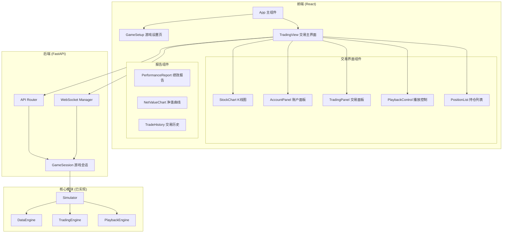

# Design Document

## Overview

本设计文档描述 A 股模拟交易回测系统的 Web 前端架构。系统采用前后端分离架构：
- **后端**: FastAPI 提供 RESTful API 和 WebSocket 服务
- **前端**: React + TypeScript 单页应用，使用 ECharts 绘制图表

## Architecture



## Components and Interfaces

### 后端 API 设计

#### FastAPI 应用结构

```python
# api/main.py
from fastapi import FastAPI, WebSocket
from fastapi.middleware.cors import CORSMiddleware

app = FastAPI(title="A股模拟交易系统")

app.add_middleware(
    CORSMiddleware,
    allow_origins=["http://localhost:3000"],
    allow_methods=["*"],
    allow_headers=["*"],
)
```

#### API 端点

```python
# api/routers/stocks.py
from fastapi import APIRouter
from pydantic import BaseModel

router = APIRouter(prefix="/api/stocks", tags=["stocks"])

class StockInfo(BaseModel):
    code: str
    name: str
    market: str

@router.get("/", response_model=list[StockInfo])
async def get_stock_list():
    """获取股票列表"""
    pass

@router.get("/{code}/daily")
async def get_daily_data(code: str, start_date: str, end_date: str):
    """获取日线数据"""
    pass
```

```python
# api/routers/game.py
from fastapi import APIRouter, HTTPException
from pydantic import BaseModel

router = APIRouter(prefix="/api/game", tags=["game"])

class GameStartRequest(BaseModel):
    stock_codes: list[str]
    start_date: str
    end_date: str
    initial_cash: float = 100000.0

class GameStartResponse(BaseModel):
    session_id: str
    current_date: str
    trading_dates: list[str]

@router.post("/start", response_model=GameStartResponse)
async def start_game(request: GameStartRequest):
    """开始新游戏"""
    pass

class OrderRequest(BaseModel):
    session_id: str
    code: str
    price: float
    quantity: int

class OrderResponse(BaseModel):
    success: bool
    order_id: str | None
    message: str
    fee: float | None

@router.post("/buy", response_model=OrderResponse)
async def buy_stock(request: OrderRequest):
    """买入股票"""
    pass

@router.post("/sell", response_model=OrderResponse)
async def sell_stock(request: OrderRequest):
    """卖出股票"""
    pass

@router.get("/{session_id}/account")
async def get_account(session_id: str):
    """获取账户状态"""
    pass

@router.get("/{session_id}/metrics")
async def get_metrics(session_id: str):
    """获取绩效指标"""
    pass

@router.post("/{session_id}/next-day")
async def next_day(session_id: str):
    """进入下一交易日"""
    pass
```

#### WebSocket 接口

```python
# api/routers/websocket.py
from fastapi import WebSocket, WebSocketDisconnect

class PlaybackMessage(BaseModel):
    type: str  # "tick", "day_end", "finished"
    data: dict

@router.websocket("/ws/playback/{session_id}")
async def playback_websocket(websocket: WebSocket, session_id: str):
    """
    WebSocket 连接用于实时推送行情
    
    客户端发送:
    - {"action": "play", "speed": 10}
    - {"action": "pause"}
    - {"action": "next_day"}
    
    服务端推送:
    - {"type": "tick", "data": {"time": "09:31", "prices": {...}}}
    - {"type": "day_end", "data": {"date": "2024-01-02"}}
    - {"type": "account_update", "data": {...}}
    """
    pass
```

### 前端组件设计

#### 项目结构

```
frontend/
├── src/
│   ├── components/
│   │   ├── StockChart.tsx       # K线图组件
│   │   ├── AccountPanel.tsx     # 账户信息面板
│   │   ├── TradingPanel.tsx     # 交易面板
│   │   ├── PlaybackControl.tsx  # 播放控制
│   │   ├── PositionList.tsx     # 持仓列表
│   │   ├── PerformanceReport.tsx # 绩效报告
│   │   └── StockSelector.tsx    # 股票选择器
│   ├── pages/
│   │   ├── GameSetup.tsx        # 游戏设置页
│   │   └── TradingView.tsx      # 交易主界面
│   ├── hooks/
│   │   ├── useWebSocket.ts      # WebSocket Hook
│   │   └── useGameState.ts      # 游戏状态 Hook
│   ├── services/
│   │   └── api.ts               # API 调用封装
│   ├── types/
│   │   └── index.ts             # TypeScript 类型定义
│   ├── App.tsx
│   └── main.tsx
├── package.json
└── vite.config.ts
```

#### TypeScript 类型定义

```typescript
// types/index.ts

export interface StockInfo {
  code: string;
  name: string;
  market: string;
}

export interface DailyBar {
  date: string;
  open: number;
  high: number;
  low: number;
  close: number;
  volume: number;
}

export interface Position {
  code: string;
  quantity: number;
  costPrice: number;
  currentPrice: number;
  profitLoss: number;
  profitLossPct: number;
}

export interface Account {
  cash: number;
  totalAssets: number;
  totalMarketValue: number;
  positions: Position[];
}

export interface GameState {
  sessionId: string;
  currentDate: string;
  currentTime: string;
  playbackState: 'idle' | 'playing' | 'paused' | 'day_ended' | 'finished';
  speed: number;
}

export interface PerformanceMetrics {
  totalReturn: number;
  maxDrawdown: number;
  winRate: number;
  sharpeRatio: number;
  totalTrades: number;
  winningTrades: number;
  losingTrades: number;
}

export interface TradeRecord {
  date: string;
  code: string;
  type: 'buy' | 'sell';
  price: number;
  quantity: number;
  fee: number;
  status: 'filled' | 'rejected';
}
```

#### 核心组件接口

```typescript
// components/StockChart.tsx
interface StockChartProps {
  code: string;
  dailyData: DailyBar[];
  intradayData?: IntradayTick[];
  viewMode: 'daily' | 'intraday';
  onViewModeChange: (mode: 'daily' | 'intraday') => void;
}

// components/TradingPanel.tsx
interface TradingPanelProps {
  currentPrice: number;
  stockCode: string;
  cash: number;
  position?: Position;
  disabled: boolean;  // 非暂停状态时禁用
  onBuy: (price: number, quantity: number) => Promise<void>;
  onSell: (price: number, quantity: number) => Promise<void>;
}

// components/PlaybackControl.tsx
interface PlaybackControlProps {
  state: GameState;
  onPlay: () => void;
  onPause: () => void;
  onSpeedChange: (speed: number) => void;
  onNextDay: () => void;
}

// components/AccountPanel.tsx
interface AccountPanelProps {
  account: Account;
  initialCash: number;
}
```

## Data Models

### API 请求/响应模型

#### 游戏开始

```json
// POST /api/game/start
// Request
{
  "stock_codes": ["600519", "000001"],
  "start_date": "2024-01-01",
  "end_date": "2024-06-30",
  "initial_cash": 100000
}

// Response
{
  "session_id": "abc123",
  "current_date": "2024-01-02",
  "trading_dates": ["2024-01-02", "2024-01-03", ...]
}
```

#### 账户状态

```json
// GET /api/game/{session_id}/account
{
  "cash": 85000.00,
  "total_assets": 102500.00,
  "total_market_value": 17500.00,
  "positions": [
    {
      "code": "600519",
      "quantity": 100,
      "cost_price": 1500.00,
      "current_price": 1750.00,
      "profit_loss": 25000.00,
      "profit_loss_pct": 0.1667
    }
  ]
}
```

#### WebSocket 消息

```json
// 客户端 -> 服务端
{"action": "play", "speed": 10}
{"action": "pause"}

// 服务端 -> 客户端
{
  "type": "tick",
  "data": {
    "time": "09:31",
    "prices": {
      "600519": 1752.50,
      "000001": 10.25
    }
  }
}

{
  "type": "account_update",
  "data": {
    "cash": 85000.00,
    "total_assets": 102750.00,
    "positions": [...]
  }
}

{
  "type": "day_end",
  "data": {
    "date": "2024-01-02",
    "summary": {
      "trades": 2,
      "profit_loss": 500.00
    }
  }
}
```


## Correctness Properties

*A property is a characteristic or behavior that should hold true across all valid executions of a system—essentially, a formal statement about what the system should do. Properties serve as the bridge between human-readable specifications and machine-verifiable correctness guarantees.*

### Property 1: API 响应数据一致性

*For any* API 请求，返回的账户数据应满足：total_assets == cash + total_market_value

**Validates: Requirements 2.1**

### Property 2: WebSocket 消息顺序

*For any* 播放会话，tick 消息的时间应单调递增，不应出现时间倒退

**Validates: Requirements 4.3**

### Property 3: 交易状态限制

*For any* 交易请求，如果当前播放状态不是 "paused"，API 应返回错误

**Validates: Requirements 4.4**

### Property 4: 价格显示颜色

*For any* 价格变化，如果 current_price > cost_price 显示红色，否则显示绿色

**Validates: Requirements 2.4**

### Property 5: 订单响应完整性

*For any* 订单请求，响应必须包含 success 状态，失败时必须包含 message

**Validates: Requirements 3.3, 3.4**

## Error Handling

### API 错误处理

| HTTP 状态码 | 错误场景 | 响应格式 |
|------------|---------|---------|
| 400 | 请求参数无效 | `{"detail": "Invalid stock code"}` |
| 404 | 会话不存在 | `{"detail": "Session not found"}` |
| 409 | 状态冲突（非暂停状态交易） | `{"detail": "Trading only allowed when paused"}` |
| 500 | 服务器内部错误 | `{"detail": "Internal server error"}` |

### WebSocket 错误处理

| 错误类型 | 处理方式 |
|---------|---------|
| 连接断开 | 前端自动重连，最多重试3次 |
| 消息解析失败 | 记录日志，忽略该消息 |
| 会话过期 | 发送 `{"type": "error", "message": "Session expired"}` |

### 前端错误处理

```typescript
// 统一错误处理
interface ApiError {
  status: number;
  message: string;
}

// 错误提示组件
const showError = (error: ApiError) => {
  toast.error(error.message);
};
```

## Testing Strategy

### 后端测试

- **单元测试**: pytest 测试 API 端点逻辑
- **集成测试**: 测试 API 与核心模块的集成
- **WebSocket 测试**: 测试实时消息推送

### 前端测试

- **组件测试**: Vitest + React Testing Library
- **E2E 测试**: Playwright（可选）

### 测试配置

```python
# 后端测试使用 pytest
pytest tests/api/

# 前端测试使用 vitest
npm run test
```

## 技术栈

### 后端
- FastAPI 0.100+
- Uvicorn (ASGI 服务器)
- Pydantic (数据验证)
- WebSockets

### 前端
- React 18
- TypeScript 5
- Vite (构建工具)
- ECharts (图表库)
- Ant Design (UI 组件库)
- Axios (HTTP 客户端)

