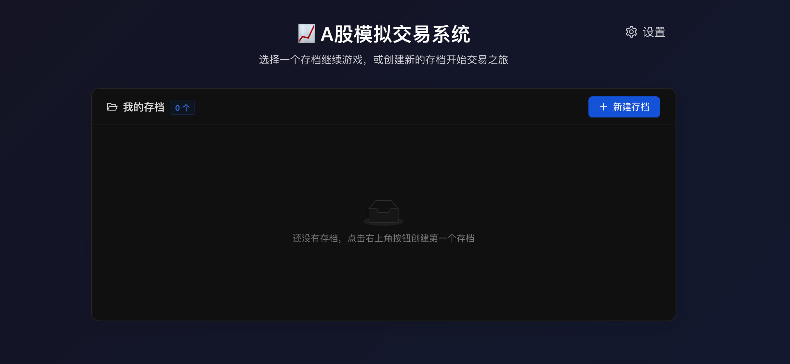
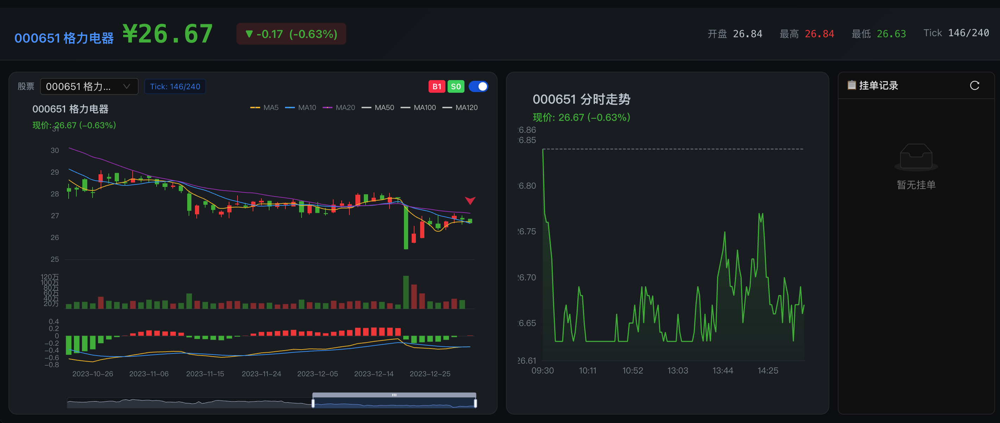
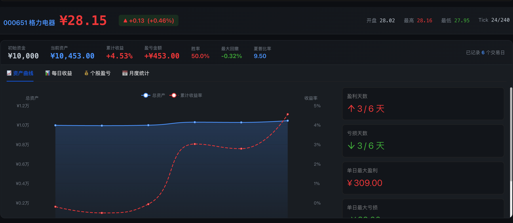
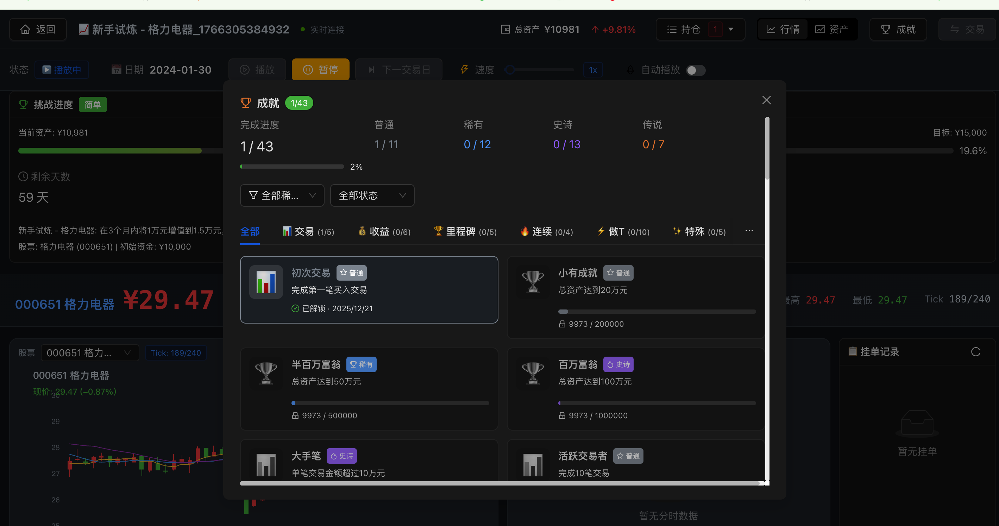
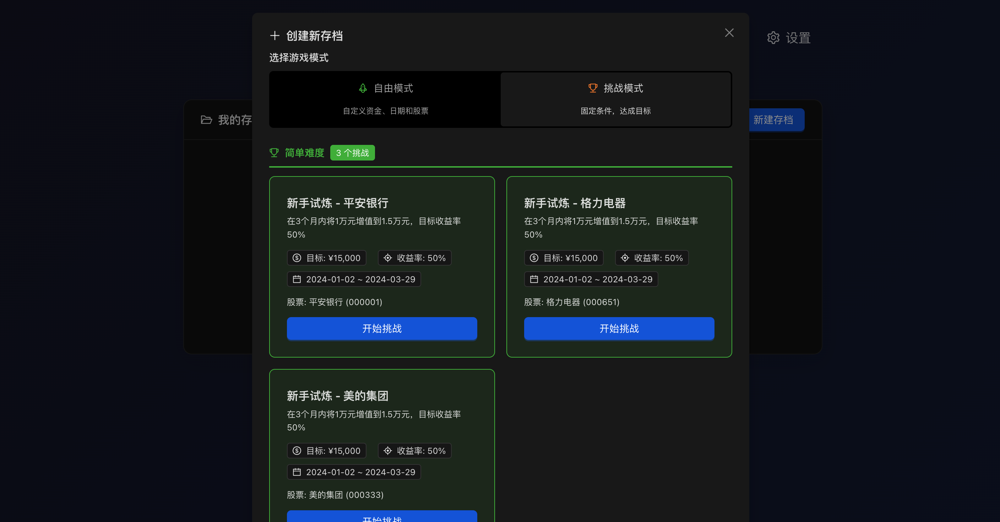

# 🥬 韭菜模拟器 (RealStock)

一个功能完整的 A 股模拟交易系统，支持历史行情回放、实时交易模拟、挑战模式、成就系统和排行榜。在这里体验股市的酸甜苦辣，成为一棵坚强的韭菜！


## ✨ 功能特性

### 核心功能
- **📊 历史行情回放**: 基于真实历史数据，支持可调速度的盘中行情播放
- **💰 虚拟交易**: 完整的买入/卖出功能，遵守 T+1 规则和涨跌停限制
- **📁 存档系统**: 支持多存档管理，随时保存和恢复交易进度
- **📈 资产追踪**: 实时显示账户资产、持仓盈亏、收益曲线

### 游戏化功能
- **🏆 挑战模式**: 预设挑战目标，在限定时间内达成收益目标
- **🎖️ 成就系统**: 丰富的成就徽章，记录交易里程碑
- **📊 做T统计**: 专门统计日内做T交易的盈亏情况
- **🏅 排行榜**: 多维度排行榜，与其他玩家比拼

### 技术特性
- **WebSocket 实时通信**: 低延迟的行情推送
- **响应式设计**: 支持深色/浅色主题切换
- **本地数据缓存**: 减少 API 调用，提升加载速度

## 🖼️ 界面预览

### 首页 - 存档管理


### 交易界面 - K线图与分时图


### 资产界面 - 收益曲线


### 成就系统


### 挑战模式


## 🚀 快速开始

### 环境要求

- Python 3.10+
- Node.js 18+
- npm 或 yarn

### 安装步骤

1. **克隆项目**
```bash
git clone https://github.com/Andrew82106/RealStock.git
cd RealStock
```

2. **安装后端依赖**
```bash
pip install -e .
# 或者安装开发依赖
pip install -e ".[dev]"
```

3. **安装前端依赖**
```bash
cd frontend
npm install
cd ..
```

### 启动项目

1. **启动后端服务**
```bash
python -m uvicorn api.main:app --reload --port 8000
```

2. **启动前端开发服务器**（新终端）
```bash
cd frontend
npm run dev
```

3. **访问应用**

打开浏览器访问 http://localhost:5173

## 📖 使用指南

### 创建存档

1. 在首页点击「新建存档」
2. 输入存档名称和初始资金
3. 选择自由模式或挑战模式

### 交易操作

1. 进入存档后，点击「添加股票」搜索并添加要交易的股票
2. 点击「播放」开始行情回放
3. 点击「暂停」后可以进行买入/卖出操作
4. 支持挂单交易，订单会在价格触及时自动成交

### 挑战模式

1. 在首页选择「挑战模式」
2. 选择难度（简单/中等/困难）
3. 在限定时间内达成目标收益
4. 完成挑战可解锁成就

## 🏗️ 项目结构

```
realstock/
├── api/                    # 后端 API
│   ├── routers/           # API 路由
│   │   ├── game.py        # 游戏控制
│   │   ├── websocket.py   # WebSocket 播放
│   │   ├── saves.py       # 存档管理
│   │   ├── achievements.py # 成就系统
│   │   ├── challenges.py  # 挑战模式
│   │   ├── t_trades.py    # 做T统计
│   │   └── leaderboard.py # 排行榜
│   └── services/          # 业务逻辑
├── src/                    # 核心模块
│   ├── data_engine/       # 数据引擎（AkShare）
│   ├── account/           # 账户系统
│   ├── trading/           # 交易引擎
│   ├── playback/          # 播放引擎
│   └── simulator/         # 模拟器
├── frontend/              # React 前端
│   └── src/
│       ├── components/    # UI 组件
│       ├── pages/         # 页面
│       ├── services/      # API 服务
│       ├── hooks/         # React Hooks
│       └── types/         # TypeScript 类型
├── tests/                 # 测试
│   ├── unit/             # 单元测试
│   ├── property/         # 属性测试
│   └── integration/      # 集成测试
├── storage/              # 数据存储
│   └── saves/            # 存档文件
└── examples/             # 示例脚本
```

## 🔧 技术栈

### 后端
- **FastAPI**: 高性能 Web 框架
- **WebSocket**: 实时通信
- **AkShare**: A股数据源
- **Pandas/NumPy**: 数据处理

### 前端
- **React 18**: UI 框架
- **TypeScript**: 类型安全
- **Ant Design**: UI 组件库
- **ECharts**: 图表库
- **Vite**: 构建工具

### 测试
- **Pytest**: 测试框架
- **Hypothesis**: 属性测试

## 📊 交易规则

| 规则 | 说明 |
|------|------|
| T+1 | 当天买入的股票次日才能卖出 |
| 涨跌停 | 委托价格必须在涨跌停范围内 |
| 最小单位 | 买入数量必须是 100 股的整数倍 |
| 佣金 | 0.025%，最低 5 元 |
| 印花税 | 卖出时收取 0.05% |

## 🧪 运行测试

```bash
# 运行所有测试
pytest

# 运行单元测试
pytest tests/unit/

# 运行属性测试
pytest tests/property/

# 运行集成测试
pytest tests/integration/

# 查看测试覆盖率
pytest --cov=src --cov=api
```

## 🤝 贡献指南

欢迎提交 Issue 和 Pull Request！

1. Fork 本仓库
2. 创建特性分支 (`git checkout -b feature/AmazingFeature`)
3. 提交更改 (`git commit -m 'Add some AmazingFeature'`)
4. 推送到分支 (`git push origin feature/AmazingFeature`)
5. 提交 Pull Request

## 📝 开发计划

- [ ] 支持更多技术指标（MACD、KDJ、布林带等）
- [ ] 添加策略回测功能
- [ ] 支持多股票组合交易
- [ ] 移动端适配
- [ ] 社区功能（分享策略、交流讨论）

## ⚠️ 免责声明

本项目仅供学习和娱乐目的，不构成任何投资建议。股市有风险，投资需谨慎。

## 📄 许可证

本项目采用 MIT 许可证 - 详见 [LICENSE](LICENSE) 文件

## 🙏 致谢

- [AkShare](https://github.com/akfamily/akshare) - 提供 A 股数据接口
- [Ant Design](https://ant.design/) - 优秀的 React UI 组件库
- [ECharts](https://echarts.apache.org/) - 强大的图表库
│   │   └── models.py
│   ├── playback/         # 播放引擎模块
│   │   ├── engine.py
│   │   └── models.py
│   ├── simulator/        # 模拟器模块
│   │   └── simulator.py
│   └── exceptions.py     # 自定义异常
├── tests/
│   ├── unit/             # 单元测试
│   ├── property/         # 属性测试
│   └── integration/      # 集成测试
├── examples/
│   ├── simple_backtest.py    # 简单回测示例
│   └── interactive_play.py   # 交互式播放示例
├── data_cache/           # 数据缓存目录
├── pyproject.toml        # 项目配置
└── README.md             # 项目说明
```

## 测试

```bash
# 运行所有测试
pytest

# 运行单元测试
pytest tests/unit/

# 运行属性测试
pytest tests/property/

# 运行集成测试
pytest tests/integration/

# 运行测试并显示覆盖率
pytest --cov=src
```

## 注意事项

1. **数据获取**: 首次运行需要从 AkShare 下载数据，请确保网络连接正常
2. **数据缓存**: 下载的数据会缓存到本地，后续运行会更快
3. **API 限制**: AkShare 可能有访问频率限制，建议不要频繁请求大量数据
4. **分时数据**: 历史分时数据可能不可用，系统会基于日线数据模拟生成

## 许可证

MIT License
